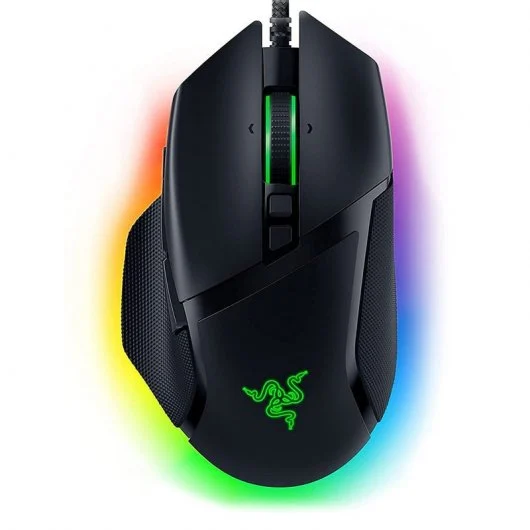

# DOCUMENTO DE DISEÑO GDD

**Hecho por [KOSA Studio]** compuesto por: Santiago Salto Molodojen, Zhuokai Zhu, Óscar Silva Urbina y Alejandro Menéndez Fierro.

---

## 1. Resumen

### 1.1 Descripción

Eres una ardilla exploradora, y te tendrás que hacer camino entre múltiples obstáculos y loros pirata, para llegar antes al tesoro de la "gran bellota". Para guiarte de que camino seguir, deberás conseguir todos los coleccionables del nivel para poder superar el nivel, volverte más rápido, y también para conseguir aura.

### 1.2 Género

Plataformas, Niveles y puzzles.

### 1.3 Setting

*(Pendiente)*

### 1.4 Cartas usadas

  

- **Fez:** niveles diseñados con plataformas. Bono extra: el juego solo se juega con el ratón. **+2p**
- **The legend of Zelda:** niveles en los que el jugador debe recolectar los puzzles bajo presión de tiempo para poder superarlos. **+2p**
- **Japón:** niveles diseñados con elementos asiáticos. Bono extra: el jugador tiene que recolectar los "trazos" de una palabra chino/japonés/koreano. **+3p**
- **Mundo de fantasía:** niveles diseñados con elementos de un mundo de fantasía. Bono extra: utilizar dos cartas de personajes no humanos. **+2p**
- **Loro pirata:** aparecerán loros piratas como enemigos. Bono extra: si todos los personajes del juego son no humanos, se podrá robar una carta de otro grupo y su punto. **+1p +?p**
- **Ardilla invencible:** aparecerá una ardilla como protagonista jugable del juego. Bono extra: hacer referencia a películas de Disney anteriores de 2006, utilizaremos la película Mulán para que se encaje con la carta Japón, y aparecerá el dragón Mushu. **+2p**

**Puntos totales: 12p + ?p**

---

## 2. Gameplay

### 2.1 Corto, Medio, Largo Plazo

**Corto:**
- Superar los elementos de plataformas
- Superar a los enemigos, ya sea atacandolos o evitándolos.

**Medio:**
- Encontrar y recoger los coleccionables del nivel.

**Largo:**
- Acabar el nivel a tiempo.

### 2.2 Core Loops

Correr por el nivel, pasar los obstáculos, recoger los coleccionables y terminar el nivel.

- **Victoria:** conseguir superar todos los niveles.
- **Derrota:** al perder todas las vidas que tiene la ardilla (protagonista)?

---

## 3. Mecánicas

### 3.1 Movimiento

El personaje se controla con el ratón. Al mover el cursor, se define la dirección en la que se desplazará el personaje. Si se hace clic izquierdo, el personaje avanza en la dirección indicada por el cursor. La velocidad depende de la distancia entre el cursor y el personaje: si está cerca, el personaje se mueve despacio, si está lejos, corre.

  

  

### 3.2 Salto

Para saltar, el sistema detecta si el cursor está colocado sobre el personaje respecto al eje y positivo. Si es así, el personaje saltará en la dirección a la que está apuntando el cursor. Al igual que con el movimiento en el suelo, alejar más el ratón del personaje hará que este salte más alto.

  

### 3.3 Ataque

Para atacar, se utiliza el clic derecho. Al pulsarlo el personaje entra en estado de ataque y se detiene. Cuando se está en el estado de ataque, el jugador no puede moverse, pero si estaba en el aire antes de entrar en ese estado, se seguirá impulsando en la dirección a la que estaba moviéndose antes de pulsar el click derecho del ratón. Mientras se mantiene pulsado el clic derecho, el jugador puede apuntar en la dirección deseada, y al soltarlo, el personaje lanzará un proyectil en esa misma dirección. *(Explicar con más detalle, como funciona en Raft Wars??)*

El proyectil que se lanza en el ataque se mueve en forma de parábola. Este proyectil se usará para derrotar a enemigos que están por el nivel, disparar a objetivos que hay que acertar para avanzar (hacer aparecer un elemento de nivel que te ayude, o eliminar uno que te estorbaba), o romper bloques frágiles que hay por el nivel. El ataque también puede empujar cajas irrompibles cuando impacta en ellas.

  

  

### 3.4 Recolección de símbolos

A lo largo del nivel se encuentran piezas de un símbolo que hay que recolectar para poder completar el nivel. Al conseguir todas las piezas el jugador recibe un potenciador de velocidad que le servirá para llegar más cómodamente a la salida del nivel. Para simbolizar el aura en el juego, se mostrará un efecto alrededor de la ardilla indicando que ha conseguido aura tras formar todos los símbolos del nivel *(?)*

### 3.5 Enemigos

A lo largo del nivel se encontrarán enemigos que servirán como obstáculo. Estos se pueden eliminar atacandolos o simplemente se pueden esquivar para seguir avanzando. No es necesario matarlos para completar el nivel.

- **Loro movimiento vertical:** este enemigo se moverá de arriba a abajo en bucle.
- **Loro movimiento horizontal:** este enemigo se mueve de derecha a izquierda en bucle.
- **Enemigo tira-proyectiles (OPCIONAL):** es un enemigo que lanza ataques a larga distancia, como referencia de Hermanos Martillo de Mario Bros. Se ha diseñado para meter más jugabilidad al juego si el diseño de niveles es muy repetitivo.

- 

  

### 3.6 Tiempo límite y puntuación

Los niveles plantean al jugador el reto de explorar el escenario y encontrar una serie de símbolos perdidos para poder superarlos. Cada uno de estos niveles cuenta con un tiempo límite, cuanto más tiempo le sobre al jugador al completarlo, más puntos extra obtendrá. Por el contrario, si no consigue superar el nivel dentro del tiempo establecido, recibirá una penalización. Los enemigos derrotados también darán algo de puntuación.

### 3.7 Niveles

Tipos de plataformas y componentes del nivel:

- Símbolo en piezas
- Suelo/Pared: Bloques fijos
- Plataformas que se mueven
- Cajas/objetos afectados por gravedad: el jugador las puede mover empujando desde un lado
- Pinchos/bloques dañinos: tocarlos daña al jugador
- Bloque frágil: Se pueden romper usando los proyectiles de ataque

- 

  

### 3.8 Controles

Solo se usarán el click izquierdo y derecho del ratón. El click izquierdo es para el movimiento del personaje, mientras que el click derecho es para que ataque con un proyectil.

  

---

## 4. Interfaz

¿Qué hacemos con este apartado?

### 4.1 Menús

*(Pendiente)*

### 4.2 Niveles

*(Pendiente)*

### 4.3 UI

*(Pendiente)*

---

## 5. Experiencia de juego

*(Pendiente)*

---

## 6. Estética y Contenido

### 6.1 Música y sonido

*(Pendiente)*

---

## 7. Referencias

- **PopTropica:** en el movimiento con el ratón.
- **Raft wars:** para el ataque del jugador.
- **Crash Bandicoot:** *(Pendiente)*
