# DOCUMENTO DE DISEÑO GDD [PROYECTO BELLOTA]

**Hecho por [KOSA Studio]** compuesto por: Santiago Salto Molodojen, Zhuokai Zhu, Óscar Silva Urbina y Alejandro Menéndez Fierro.

---

## 1. Resumen

### 1.1 Descripción

Eres una ardilla exploradora, y te tendrás que hacer camino entre múltiples obstáculos y loros pirata, para llegar antes al tesoro de la "gran bellota". Para guiarte de qué camino seguir, deberás conseguir todos los coleccionables del nivel para poder superarlo, volverte más rápido, y también para conseguir aura.

### 1.2 Género

Plataformas, Niveles y puzzles.

### 1.3 Setting

En el mundo de (x) los loros piratas de la isla de (x) se han propuesto conquistar el resto de islas. Para ello están recolectando los (símbolos) de poder de cada isla. De esa manera podrán debilitarlas lo suficiente para conquistar todo el archipiélago. Para detener esta catástrofe, (nombre), nuestro protagonista, embarca con la misión de recuperar la mayor cantidad de símbolos antes de que caigan en manos de los loros y reunir suficiente poder para poder derrotarlos.

### 1.4 Cartas usadas

  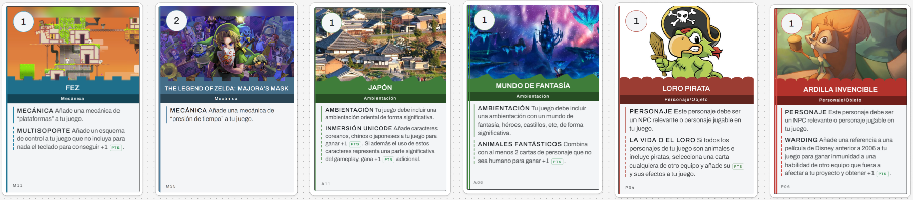

- **Fez:** niveles diseñados con plataformas. Bono extra: el juego solo se juega con el ratón. **+2p**
- **The legend of Zelda:** niveles en los que el jugador debe recolectar los puzzles (y a veces piezas de símbolos) bajo presión de tiempo para poder superarlos. **+2p**
- **Japón:** niveles diseñados con elementos asiáticos. Bono extra: el jugador tiene que recolectar los "trazos" de una palabra chino/japonés/koreano. **+3p**
- **Mundo de fantasía:** niveles diseñados con elementos de un mundo de fantasía. Bono extra: utilizar dos cartas de personajes no humanos. **+2p**
- **Loro pirata:** aparecerán loros piratas como enemigos. Bono extra: si todos los personajes del juego son no humanos, se podrá robar una carta de otro grupo y su punto. **+1p +?p**
- **Ardilla invencible:** aparecerá una ardilla como protagonista jugable del juego. Bono extra: hacer referencia a películas de Disney anteriores de 2006, utilizaremos la película Mulán para que se encaje con la carta Japón, y aparecerá el dragón Mushu. **+2p**

**Puntos totales: 12p + ?p**

---

## 2. Gameplay

### 2.1 Corto, Medio, Largo Plazo

**Corto:**
- Superar los elementos de plataformas.
- Superar a los enemigos, ya sea atacándolos o evitándolos.

**Medio:**
- Encontrar y recoger los coleccionables del nivel.

**Largo:**
- Acabar el nivel a tiempo.

### 2.2 Core Loops

Correr por el nivel, pasar los obstáculos, recoger los coleccionables y terminar el nivel.

- **Victoria:** conseguir superar todos los niveles.
- **Derrota:** al perder las vidas que tiene la ardilla, reiniciando el nivel actual.

---

## 3. Mecánicas

### 3.1 Movimiento

El personaje se controla con el ratón. Al mover el cursor, se define la dirección en la que se desplazará el personaje. Si se hace clic izquierdo, el personaje avanza en la dirección indicada por el cursor. La velocidad depende de la distancia entre el cursor y el personaje: si está cerca, el personaje se mueve despacio, si está lejos, corre.

  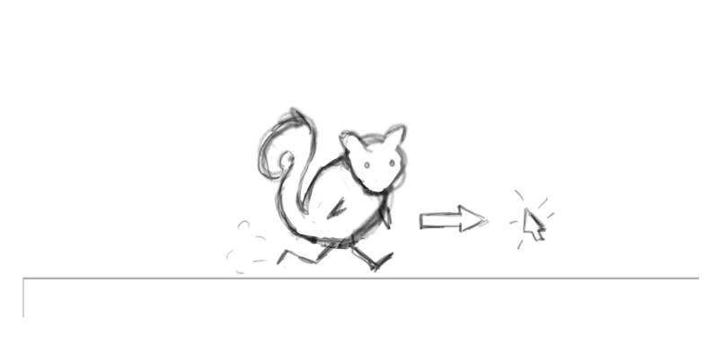

  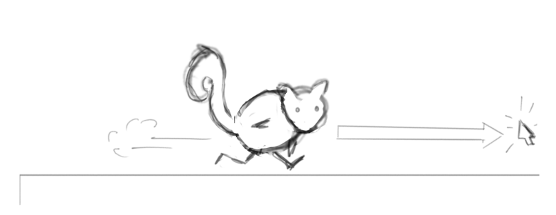

### 3.2 Salto

Para saltar, el sistema detecta si el cursor está colocado sobre el personaje respecto al eje y positivo. Si es así, el personaje saltará en la dirección a la que está apuntando el cursor. Al igual que con el movimiento en el suelo, alejar más el ratón del personaje hará que este salte más alto.

  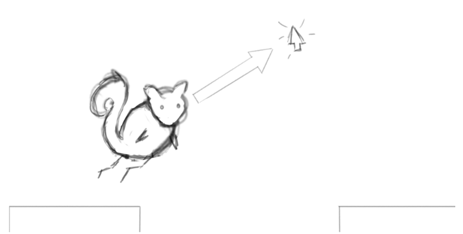

### 3.3 Ataque

Para atacar, se utiliza el clic derecho. Al pulsarlo el personaje entra en estado de ataque y se detiene. Cuando se está en el estado de ataque, el jugador no puede moverse, pero si estaba en el aire antes de entrar en ese estado, se seguirá impulsando en la dirección a la que estaba cayendo antes de pulsar el clic derecho del ratón (*Bullet Time*). Mientras se mantiene pulsado el clic derecho, el jugador puede apuntar en la dirección deseada, y al soltarlo, el personaje lanzará un proyectil en esa misma dirección. Dependiendo de la distancia arrastrada desde la posición original del clic, más fuerte se lanzará el proyectil.

El proyectil que se lanza en el ataque se mueve en forma de parábola. Este proyectil se usará para derrotar a enemigos que están por el nivel, disparar a objetivos que hay que acertar para avanzar (hacer aparecer un elemento de nivel que te ayude, o eliminar uno que te estorbaba), o romper bloques frágiles que hay por el nivel. El ataque también puede empujar cajas irrompibles cuando impacta en ellas.

  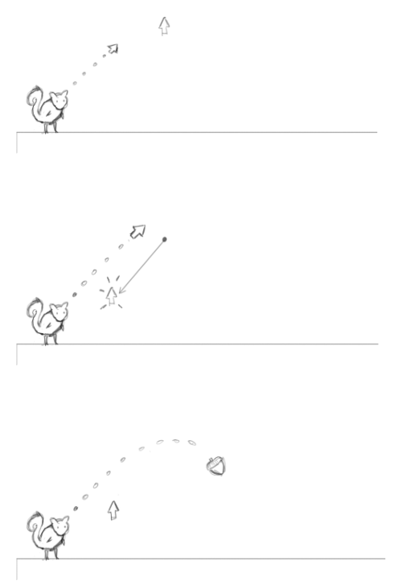

  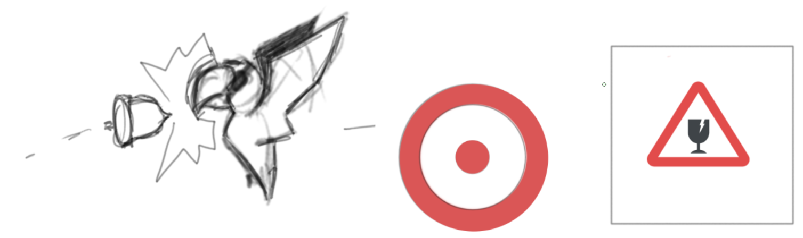

### 3.4 Recolección de símbolos

Cuando avanzas lo suficiente por el juego, se introduce una mecánica de recolección de piezas de una letra asiática (kanji) que hay que encontrar para poder salir del nivel. Las piezas se encontrarán por caminos alternativos del nivel fácilmente visibles y en medio de algunos puzzles.

Al conseguir todas las piezas el jugador recibe un potenciador de velocidad que le servirá para llegar más cómodamente a la salida del nivel. Para simbolizar el aura en el juego, se mostrará un efecto alrededor de la ardilla indicando que ha conseguido aura tras formar todos los símbolos del nivel.

### 3.5 Enemigos

A lo largo del nivel se encontrarán enemigos que servirán como obstáculo. Estos se pueden eliminar atacándolos o simplemente se pueden esquivar para seguir avanzando. No es necesario matarlos para completar el nivel.

- **Loro movimiento vertical:** este enemigo se moverá de arriba a abajo en bucle.
- **Loro movimiento horizontal:** este enemigo se mueve de derecha a izquierda en bucle.
- **Enemigo tira-proyectiles (OPCIONAL):** es un enemigo que lanza ataques a larga distancia, como referencia de los Hermanos Martillo de Mario Bros. Se ha diseñado para meter más jugabilidad al juego si el diseño de niveles es muy repetitivo.

  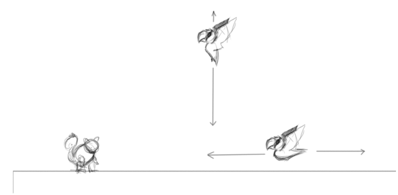

### 3.6 Tiempo límite y puntuación

Los niveles plantean al jugador el reto de explorar el escenario y encontrar una serie de símbolos perdidos para poder superarlos. Cada uno de estos niveles cuenta con un tiempo límite: cuanto más tiempo le sobre al jugador al completarlo, más puntos extra obtendrá. Por el contrario, si no consigue superar el nivel dentro del tiempo establecido, recibirá una penalización. Los enemigos derrotados también darán algo de puntuación. El daño que sufre el jugador a lo largo del nivel reduce ligeramente la puntuación que se puede conseguir al final del nivel.

### 3.7 Niveles

Los primeros niveles del juego (unos 4 o 5) se van a utilizar para introducir al jugador a las mecánicas del juego:

1. **Nivel 1:** introduce el movimiento del personaje.
2. **Nivel 2:** introduce el ataque de la ardilla, añadiendo unas dianas a las que disparar.
3. **Nivel 3:** enseña al jugador los enemigos más sencillos (los que se mueven vertical y horizontalmente sin atacar) y algún obstáculo que puede hacer daño a la ardilla.
4. **Nivel 4 en adelante:** presenta la mecánica de símbolos que hay que recoger para poder salir del nivel actual, además de ir introduciendo progresivamente los objetos y mecánicas para los puzzles que hay que completar para seguir adelante en el juego.

Estos serán los objetos que se introducirán a partir de este punto:

- **Plataformas que se mueven:** son como cualquier plataforma por la que la ardilla puede caminar, con la diferencia de que se moverán de una dirección a la siguiente lentamente. Pueden moverse horizontal, vertical e incluso diagonalmente según la necesidad del nivel.
- **Cajas/objetos afectados por gravedad:** el jugador los puede mover empujando desde un lado o usando el proyectil de ataque del personaje.
- **Pinchos/bloques dañinos:** tocarlos daña al jugador y le quita una vida.
  - **Pinchos más letales:** son más grandes, llamativos y quitan toda la vida. Están para darle más vida al ambiente, como alternativa a los huecos sin fondo, y también para dar más juego a los peligros que se le puedan presentar al jugador.
- **Bloque frágil:** se puede romper usando los proyectiles de ataque.

  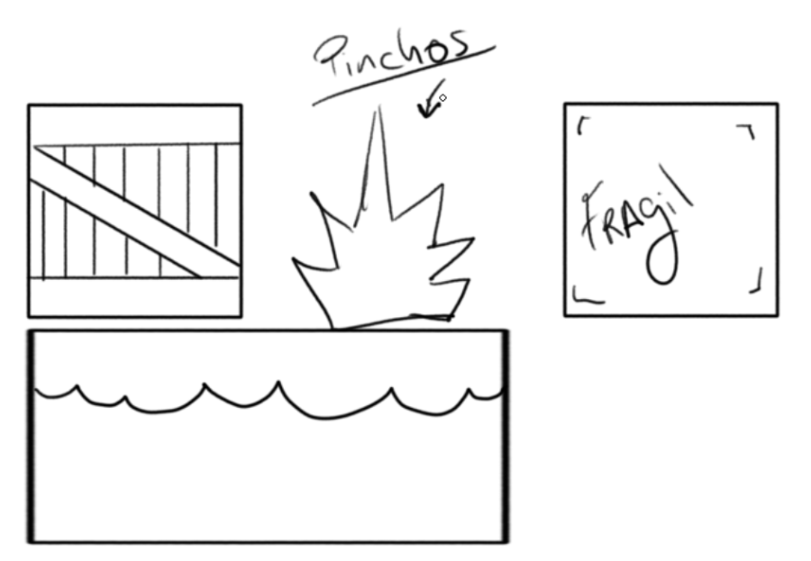

### 3.8 Controles

Solo se usarán el clic izquierdo y derecho del ratón, en combinación con el movimiento del ratón, que será apoyado/indicado con la aparición de un icono de cursor en la pantalla.

**Clic izquierdo:** nada más hacer clic izquierdo se entra en estado de movimiento, donde podemos ver 2 tipos de comportamiento:

- **Un clic:** la ardilla se mueve a la posición del cursor. Detectará si tiene que correr o saltar dependiendo de la posición del cursor respecto a la ardilla.
- **Mantener pulsado:** se detecta el input de movimiento de forma constante, y por lo tanto la ardilla seguirá continua e inmediatamente la dirección y posición del cursor a medida que el jugador va arrastrando el ratón.

  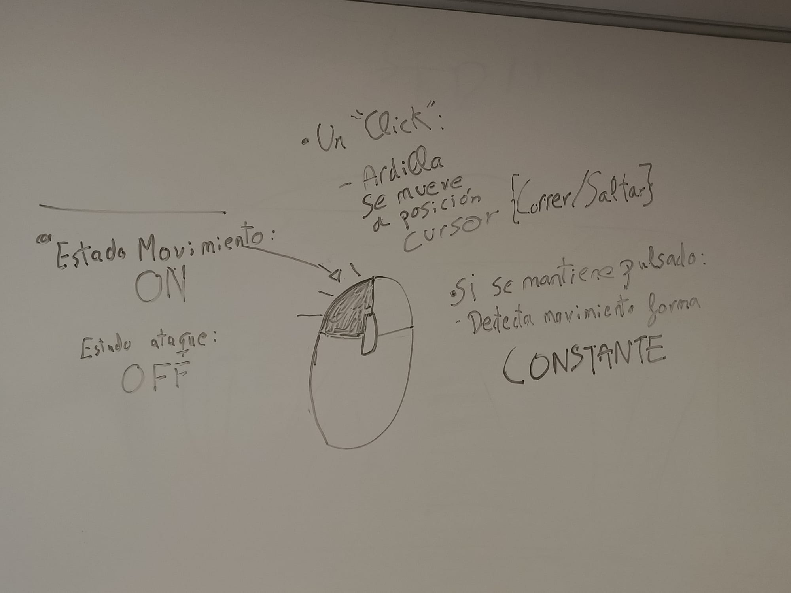

**Clic derecho:** se entra en el estado de ataque, donde la ardilla podrá lanzar proyectiles. Si está en tierra, se quedará quieta; si está en el aire, conservará la inercia del movimiento hasta quedarse sin ella. Podemos ver 2 tipos de comportamiento:

- **Mantener pulsado:** aparecerá una predicción de trayectoria y fuerza del proyectil, que el jugador podrá ir ajustando mediante el movimiento del ratón. Una vez soltado el botón, se efectuará el disparo.
- **Un clic:** al estar diseñado de forma que se haga un pre-aim a la hora de efectuar un ataque, en este caso, aunque no se pueda efectuar el primer paso de forma eficaz, se seguirá lanzando un proyectil, pero saldrá con una trayectoria totalmente errónea.

  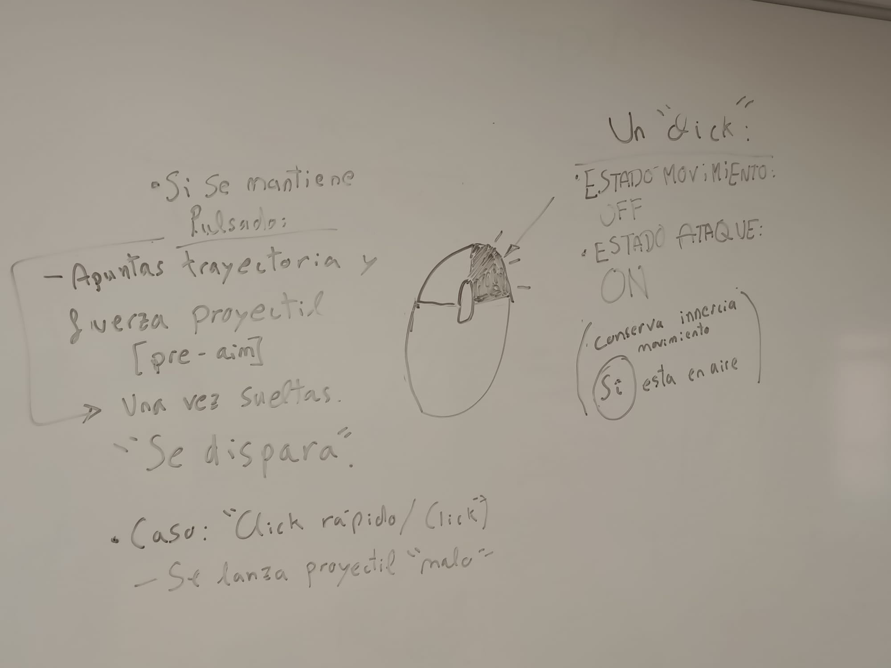

---

## 4. Diseño

### 4.1 Puzles

*(Pendiente)*

### 4.2 Mundos

- **Mundo Fantasía:** tutorial.
- **Mundo Asiático:** introducción de los símbolos.
- **Mundo Infierno:** algún obstáculo más difícil/peligroso.

---

## 5. Interfaz

### 5.1 Menús

Los menús del juego son: el menú principal, el menú de selección de niveles, el menú de pausa durante un nivel, los ajustes fuera de un nivel y los créditos.

  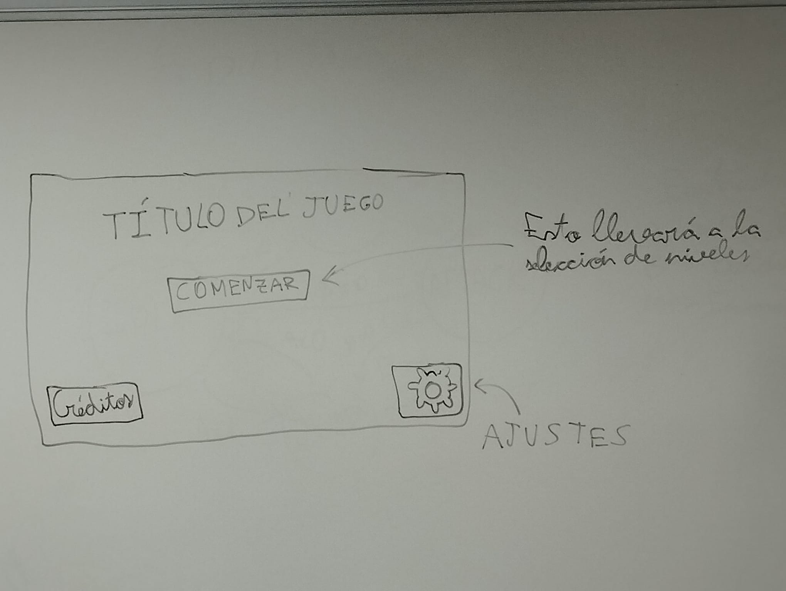

**Pantalla de menú principal**

  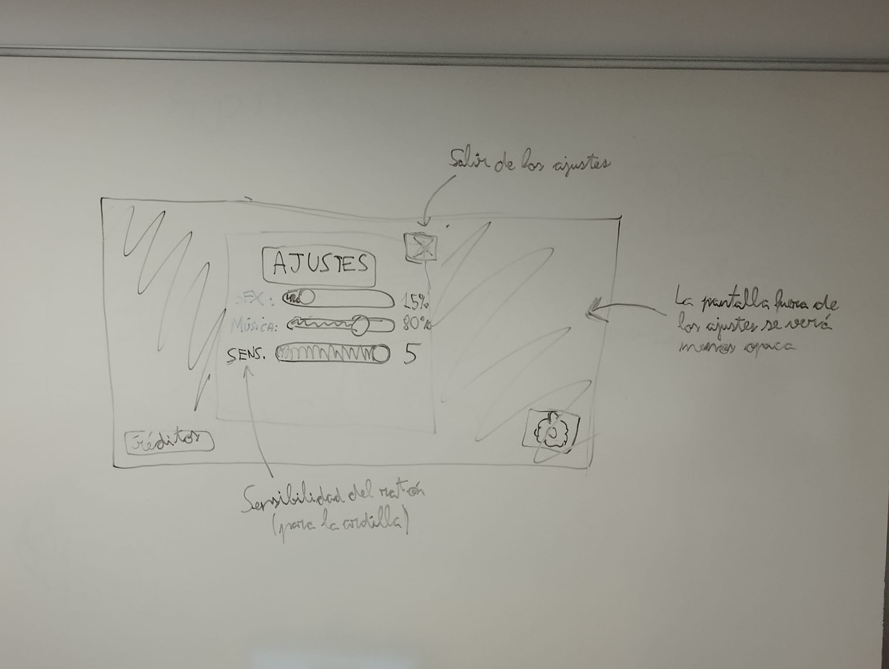

**Pantalla de ajustes** (una ventana emergente que se superpone a la pantalla de menú principal)

Notas extra: cuanta mayor sensibilidad en los ajustes (entre los valores 1 y 5), menos distancia/altura del cursor se necesitará para hacer que la ardilla corra/salte respectivamente. Cada barra de los ajustes, a la izquierda del deslizador, tendrá su mitad de color verde mientras que el resto se verá de negro.

  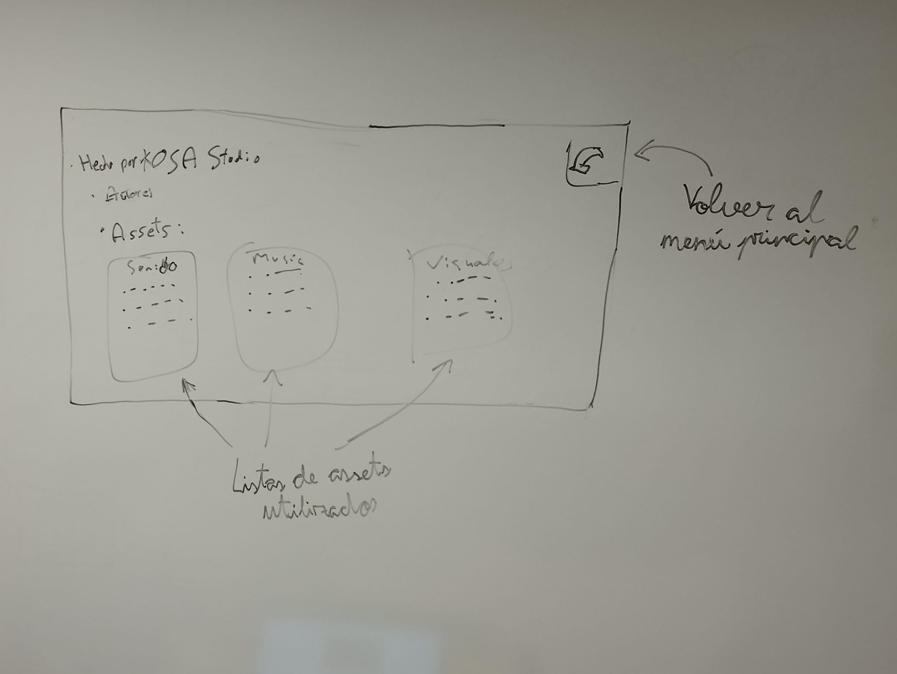

**Pantalla de créditos** (todavía no definitiva)

  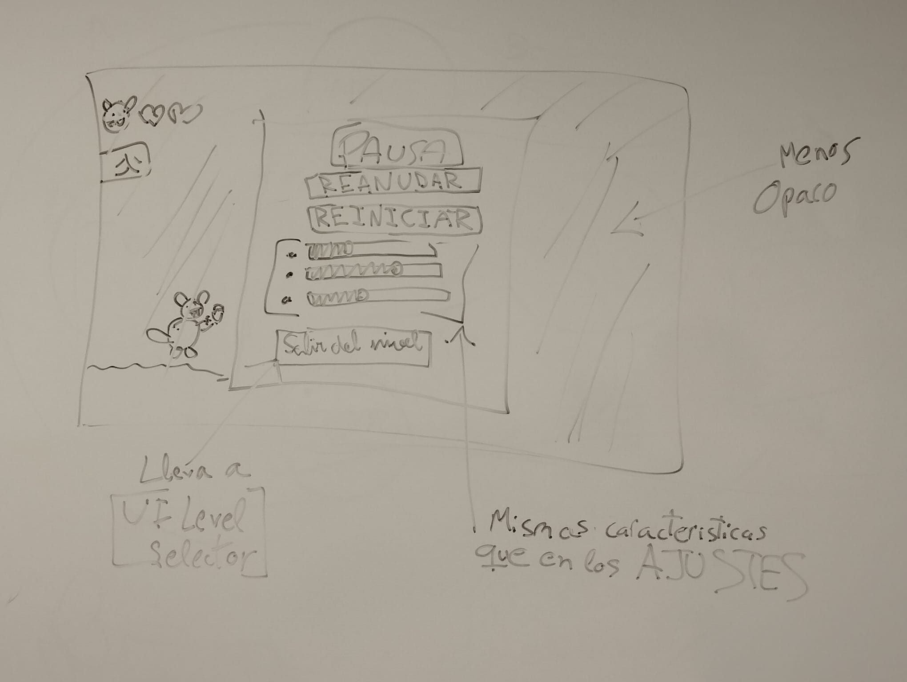

**Pantalla de pausa en un nivel**

### 5.2 Niveles

  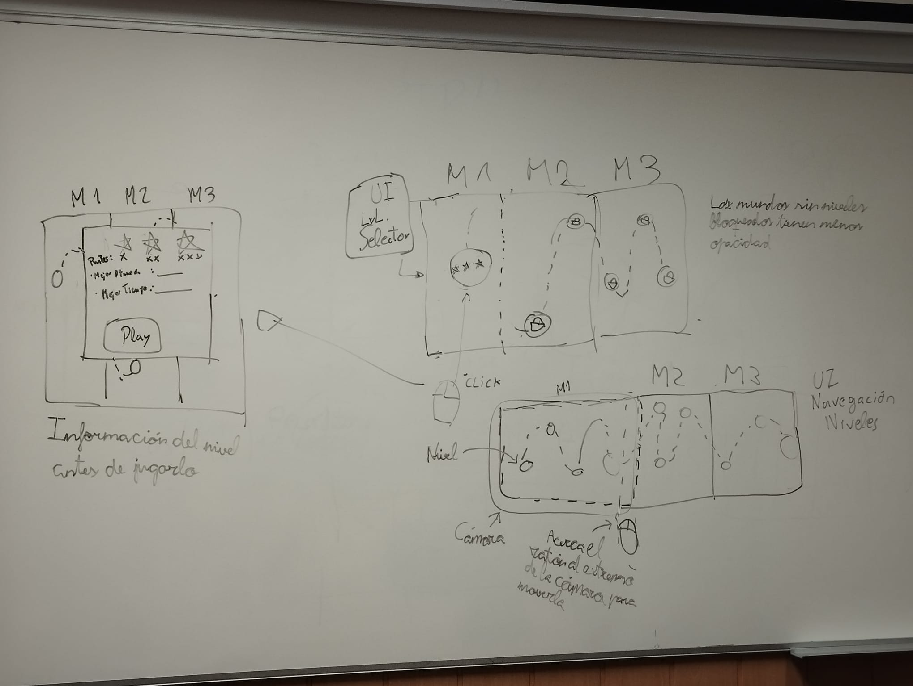

Como el mapa de niveles es más grande que la propia cámara, si acercas el ratón al extremo de la pantalla, la cámara se moverá hacia ese lado pasados unos instantes, hasta que alejes el ratón de ese extremo.

Cuando el jugador pulse un icono de nivel (un círculo que muestra las estrellas que ha conseguido el jugador si ya ha jugado el nivel, y que estará vacío si aún no lo ha superado) se mostrará una ventana que indicará las estrellas conseguidas en el nivel, cómo se consiguen (requisito de puntos en el nivel), la mejor puntuación y el mejor tiempo, aprovechando la mecánica contrarreloj del juego y aportando algo de rejugabilidad.

Los niveles deberán vencerse secuencialmente del primero al último y no se puede pasar al siguiente mundo hasta que ganes todos los niveles del mundo anterior. Los mundos inaccesibles se verán con un poco menos de opacidad de la normal, y los niveles bloqueados (los que no tienen su nivel anterior vencido) mostrarán un candado.

### 5.3 UI

Durante el gameplay la pantalla del juego se verá completa, y se apreciará:

- **Esquina superior izquierda:** las vidas (corazones) de la ardilla y el progreso en la colección de las piezas del símbolo del nivel (si existe; en caso contrario simplemente no estará presente en la interfaz).
- **Esquina superior derecha:** el botón de pausa.
- **Esquina inferior izquierda:** un recordatorio de los controles del juego (posiblemente modificables en los ajustes).

  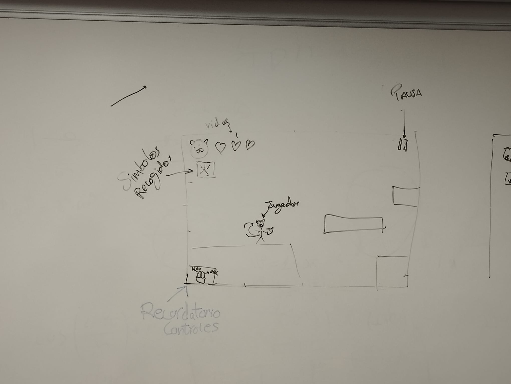

---

## 6. Experiencia de juego

El nivel se presenta con una presión contrarreloj para acabarlo, donde para avanzar tendrás que realizar los movimientos adecuados con la ardilla, accionados por el movimiento del ratón, para superar el diseño plataformero del nivel, ya sea corriendo, saltando o esquivando a los enemigos que te vayas encontrando, con la posibilidad de eliminarlos mediante el modo ataque.

A medida que vas progresando en el nivel, te encontrarás con los distintos trozos de kanji a recoger para poder terminarlo. Para llegar a ellos tendrás que encontrar el camino correcto, ya sea mediante plataformas o la resolución de puzzles en los que interviene la mecánica de ataque como método de solución.

Finalmente, tras superar el nivel, se te dará un resultado en forma de puntuación que depende de factores como el tiempo tardado en completarlo y los enemigos derrotados. En función de cuántos puntos se hayan conseguido, el jugador podrá ser recompensado con estrellas en el nivel, con un máximo de 3. Cada una de las estrellas tiene un mínimo de puntuación a superar, siendo la 1.ª la más baja y la 3.ª la más alta.

---

## 7. Estética y Contenido

*(Pendiente)*

---

## 8. Coding

### 8.1 State Pattern

Implementaremos una máquina de estados para gestionar los estados de la ardilla. Esta se compondrá de los siguientes estados:

  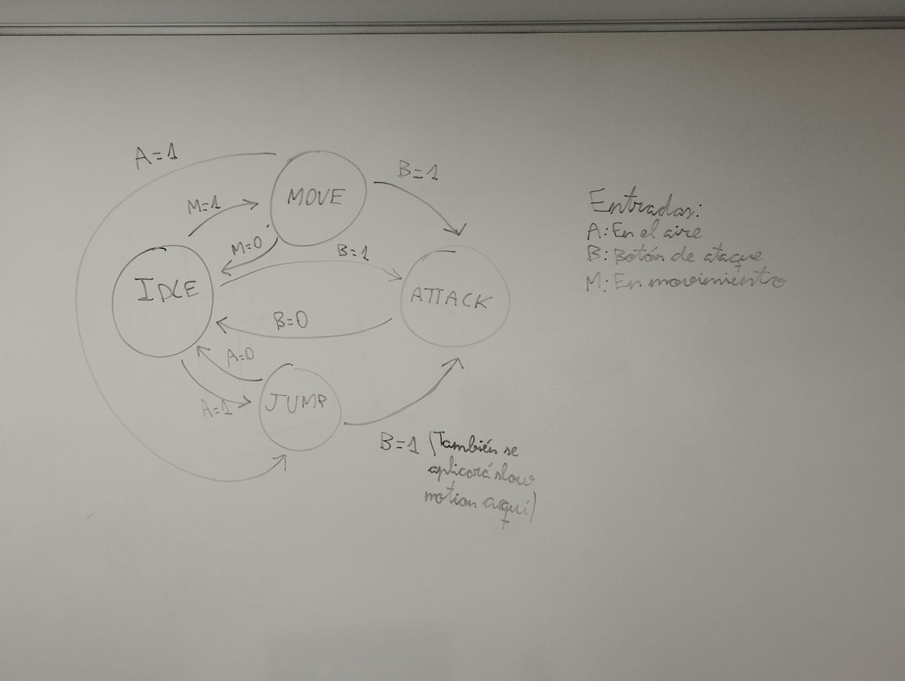

### 8.2 Component Pattern

Aplicaremos el patrón de componentes para los elementos del juego que comparten comportamiento. Por ejemplo, los enemigos comparten el mismo tipo de movimiento (vertical u horizontal, variando únicamente el eje), colisionan con la ardilla, mueren al recibir el impacto de su proyectil, etc. Encapsular estos comportamientos en componentes evita duplicar código y facilita añadir nuevos enemigos.

---

## 9. Referencias

- **PopTropica:** en el movimiento con el ratón.
- **Raft Wars:** para el ataque del jugador.
- **Cut the Rope 2:** diseño de UI de selección de niveles.
